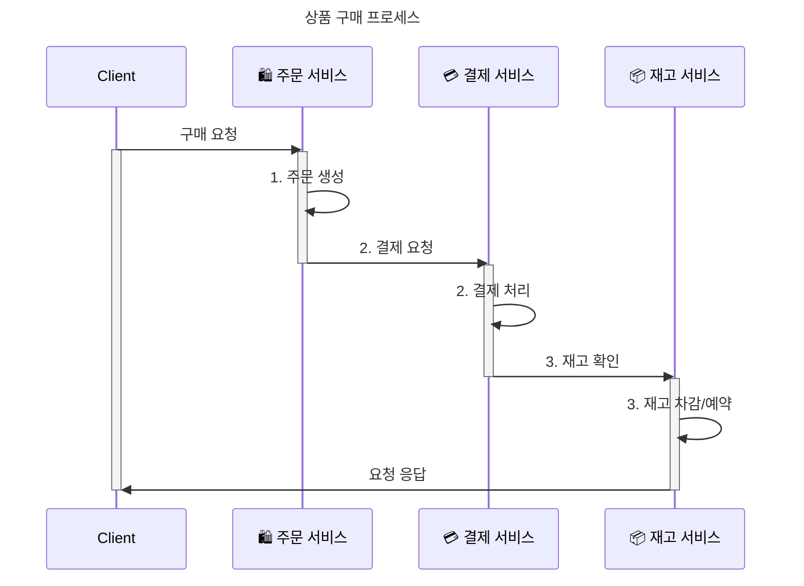

# Saga Pattern Examples

MSA 분산 시스템간 트랜잭션 Saga 패턴 구현 예제  

고객의 상품 구매 프로세스를 Orchestration 방식, Choreography 방식으로 구현하여 차이 점을 확인하는 프로젝트 입니다.

## 서비스

```
├── order/           # 주문 서비스 (Port: 8081)
├── payment/         # 결제 서비스 (Port: 8082)
├── inventory/       # 재고 서비스 (Port: 8083)
├── orchestration/   # Saga Orchestrator
└── choreography/    # Saga Choreography
```

## 시나리오
1. 고객이 상품 구매를 요청한다.
2. 주문 서비스에서는 구매 요청 주문 기록을 한다.
3. 결제 서비스에서 해당 고객의 결제 처리를 진행한다.
4. 재고 서비스에서 물품의 재고를 확인한다.



## 주요 포인트

1. **Orchestration**, **Choreography** 방식의 차이 이해
2. **보상 트랜잭션(Compensating Transaction)** 구현
3. **마이크로서비스 간 통신**
4. **분산 시스템에서의 데이터 일관성** 관리

## 기술 스택

- **Language**: Java 17
- **Framework**: Spring Boot 3.2.0
- **Build Tool**: Gradle
- **Database**: H2 (In-Memory)
- **ORM**: JPA/Hibernate
- **Message Broker**: Kafka
---
