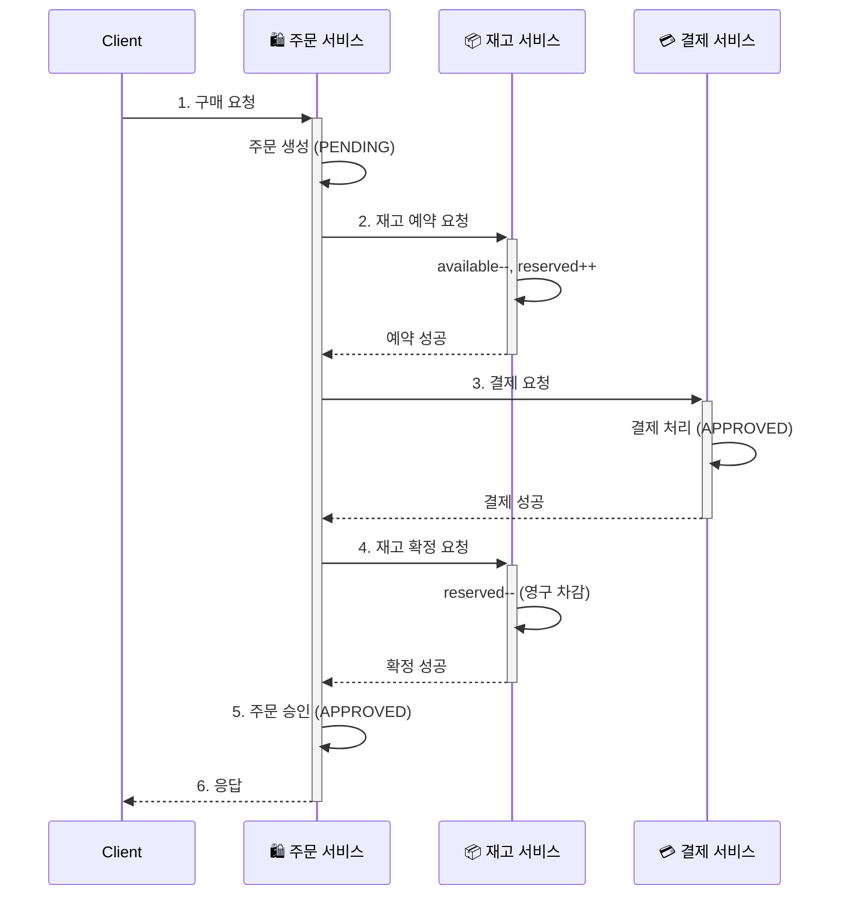

# Saga Pattern Examples

MSA 분산 트랜잭션 Saga 패턴 구현 예제  

고객의 상품 구매 프로세스를 Orchestration 방식, Choreography 방식으로 구현하여 차이 점을 확인하는 프로젝트 입니다.

> Saga 패턴이란?  
> 분산 환경에서 여러 시스템에 걸쳐 연계된 트랜잭션 수행이 필요할 때, 각 시스템에서 로컬 트랜잭션을 수행하고, 중간 단계에서 실패가 발생할 경우 보상 트랜잭션을 실행하여 데이터의 일관성을 맞추는 방법

## 서비스

```
├── order/           # 주문 서비스 (Port: 8081)
├── inventory/       # 재고 서비스 (Port: 8082)
├── payment/         # 결제 서비스 (Port: 8083)
├── orchestration/   # Saga Orchestrator
└── choreography/    # Saga Choreography
```

## 시나리오
1. 고객이 상품 구매를 요청한다.
2. 주문 서비스에서 구매 주문을 기록한다.
3. 재고 서비스에서 물품 재고를 **예약**한다 (available → reserved).
4. 결제 서비스에서 결제 처리를 진행한다.
5. 결제 성공 시 재고 예약을 **확정**한다 (reserved → 영구 차감).
6. 주문을 승인 상태로 수정한다.


```mermaid
sequenceDiagram
    participant Client
    participant OS as 🛍️ 주문 서비스
    participant IS as 📦 재고 서비스
    participant PS as 💳 결제 서비스

    Client->>+OS: 1. 구매 요청
    OS->>OS: 주문 생성 (PENDING)
    OS->>+IS: 2. 재고 예약 요청
    IS->>IS: available--, reserved++
    IS-->>-OS: 예약 성공
    OS->>+PS: 3. 결제 요청
    PS->>PS: 결제 처리 (APPROVED)
    PS-->>-OS: 결제 성공
    OS->>+IS: 4. 재고 확정 요청
    IS->>IS: reserved-- (영구 차감)
    IS-->>-OS: 확정 성공
    OS->>OS: 5. 주문 승인 (APPROVED)
    OS-->>-Client: 6. 응답
```

> **재고 도메인 모델**: `available`(예약 가능) / `reserved`(예약됨, 확정 전)을 분리하고 `InventoryReservation` 엔티티로 orderId 단위 예약을 추적합니다. e-commerce 표준 패턴이며 부분 취소, 만료, 정확한 취소를 지원합니다.

## 주요 포인트

1. **마이크로서비스 간 분산 트랜잭션 이해**
2. **Orchestration**, **Choreography** 방식의 차이 이해
3. **보상 트랜잭션** 개념 이해

## 기술 스택

- **Language**: Java 17
- **Framework**: Spring Boot 3.2.0
- **Build Tool**: Gradle
- **Database**: H2 (In-Memory)
- **ORM**: JPA/Hibernate
- **Message Broker**: Kafka

## Choreography vs Orchestration

| 특성 | Choreography | Orchestration |
|-----|--------------|---------------|
| 제어 방식 | 분산형 (각 서비스가 자율적) | 중앙 집중형 (Orchestrator) |
| 결합도 | 낮음 (이벤트 기반) | 높음 (직접 호출) |
| 복잡도 | 로직이 여러 서비스에 분산 | 로직이 한 곳에 집중 |
| 디버깅 | 어려움 (흐름 추적 복잡) | 쉬움 (중앙 관리) |
| 확장성 | 높음 | 보통 |
| 가시성 | 낮음 | 높음 |
| 적합한 경우 | 느슨한 결합, 높은 확장성 필요 | 명확한 흐름, 쉬운 관리 필요 |

각 방식의 구체적인 구현은 하위 디렉토리 README를 참고하세요.

- [Choreography 구현](./choreography/README.md)
- [Orchestration 구현](./orchestration/README.md)
---
