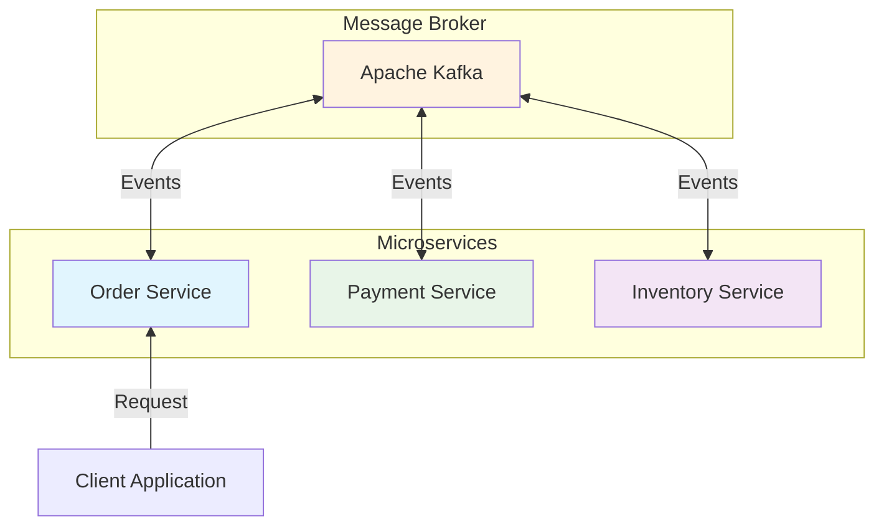
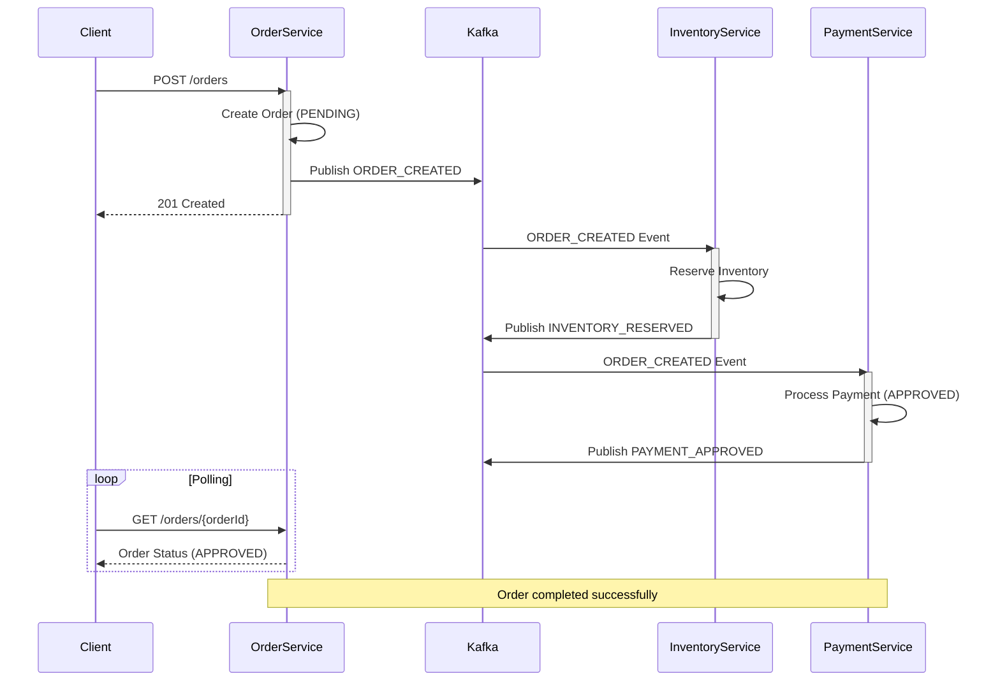
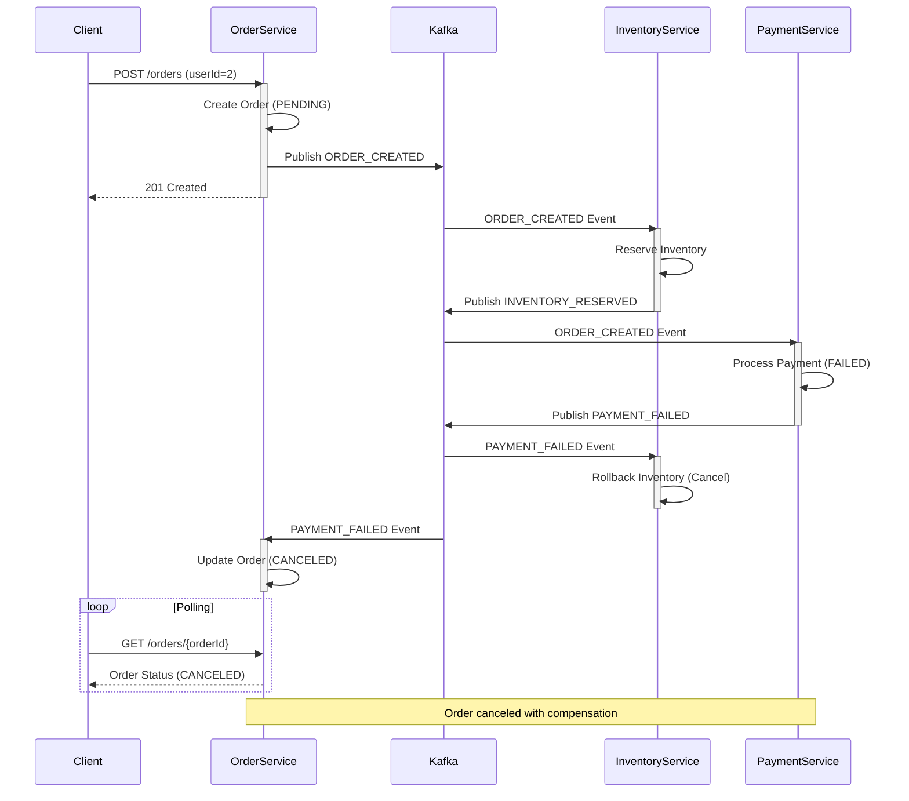

# Choreography Saga Pattern

이 프로젝트는 Choreography 방식의 Saga Pattern 구현 예제 입니다.

## 아키텍처

- 각 서비스는 이벤트를 발행 및 구독하며 처리합니다.

## 구성 요소

- **Order Service** (Port 8081): 주문 생성 및 관리
- **Inventory Service** (Port 8082): 재고 관리
- **Payment Service** (Port 8083): 결제 처리
- **Kafka (KRaft)**: 서비스 간 이벤트 메시징

## 이벤트 흐름

### Success Flow (성공 시나리오)

### Failure Flow (실패 시나리오)

### Event Types

| Service | Published Events | Subscribed Events |
|---------|-----------------|-------------------|
| **Order Service** | `ORDER_CREATED` | `PAYMENT_FAILED`, `INVENTORY_FAILED` |
| **Inventory Service** | `INVENTORY_RESERVED`, `INVENTORY_FAILED` | `ORDER_CREATED`, `PAYMENT_FAILED` |
| **Payment Service** | `PAYMENT_APPROVED`, `PAYMENT_FAILED` | `ORDER_CREATED` |

## 기술 스택

- Java 17
- Spring Boot 3.2.0
- Kafka (Confluent Platform 7.5.0)
- Gradle
- Docker & Docker Compose
