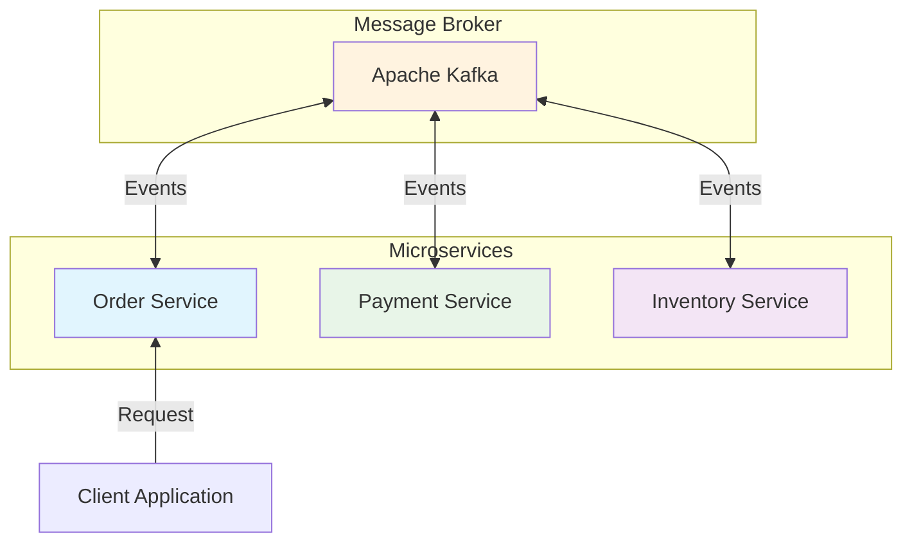
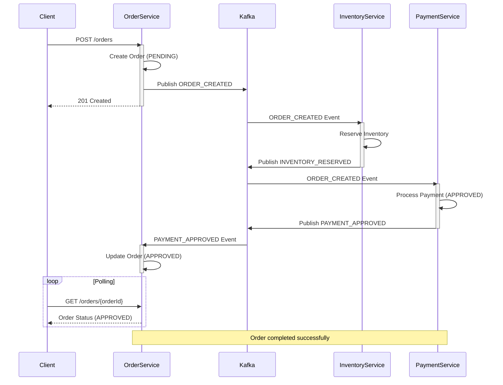
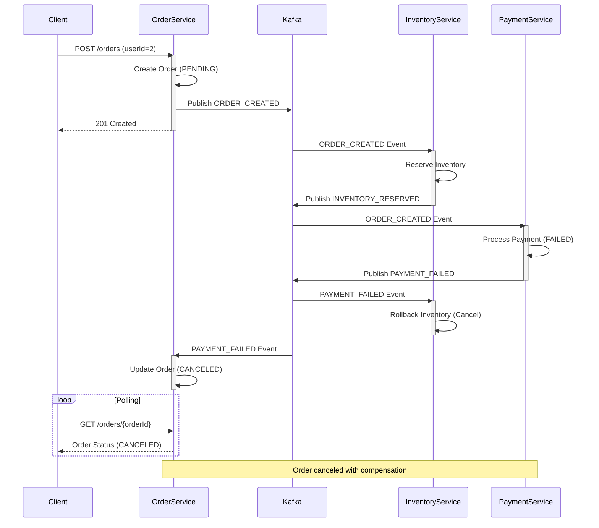

# Choreography Saga Pattern

이 프로젝트는 **Choreography** 방식의 **Saga Pattern**을 구현한 예제입니다.

## Choreography 란?

Choreography 방식은 중앙 조정자 없이 각 서비스가 이벤트를 발행하고 구독하여 분산 트랜잭션을 관리합니다. Orchestration과 달리, 각 서비스는 독립적으로 이벤트에 반응하며 자율적으로 동작합니다.

### 주요 특징

- **분산 제어**: 중앙 조정자 없이 각 서비스가 독립적으로 동작
- **이벤트 기반**: 서비스 간 느슨한 결합으로 확장성 향상
- **자율성**: 각 서비스가 자신의 로직을 독립적으로 관리
- **복잡도 분산**: 비즈니스 로직이 여러 서비스에 분산
- **보상 트랜잭션**: 실패 시 이벤트 기반 자동 롤백

## 아키텍처

- 각 서비스는 이벤트를 발행 및 구독하며 처리합니다.

## 구성 요소

- **Order Service** (Port 8081): 주문 생성 및 관리
- **Inventory Service** (Port 8082): 재고 관리
- **Payment Service** (Port 8083): 결제 처리
- **Kafka (KRaft)**: 서비스 간 이벤트 메시징

## 이벤트 흐름

### Success Flow (성공 시나리오)

### Failure Flow (실패 시나리오)

### Event Types

| Service | Published Events | Subscribed Events |
|---------|-----------------|-------------------|
| **Order Service** | `ORDER_CREATED` | `PAYMENT_APPROVED`, `PAYMENT_FAILED`, `INVENTORY_FAILED` |
| **Inventory Service** | `INVENTORY_RESERVED`, `INVENTORY_FAILED` | `ORDER_CREATED`, `PAYMENT_FAILED` |
| **Payment Service** | `PAYMENT_APPROVED`, `PAYMENT_FAILED` | `ORDER_CREATED` |

