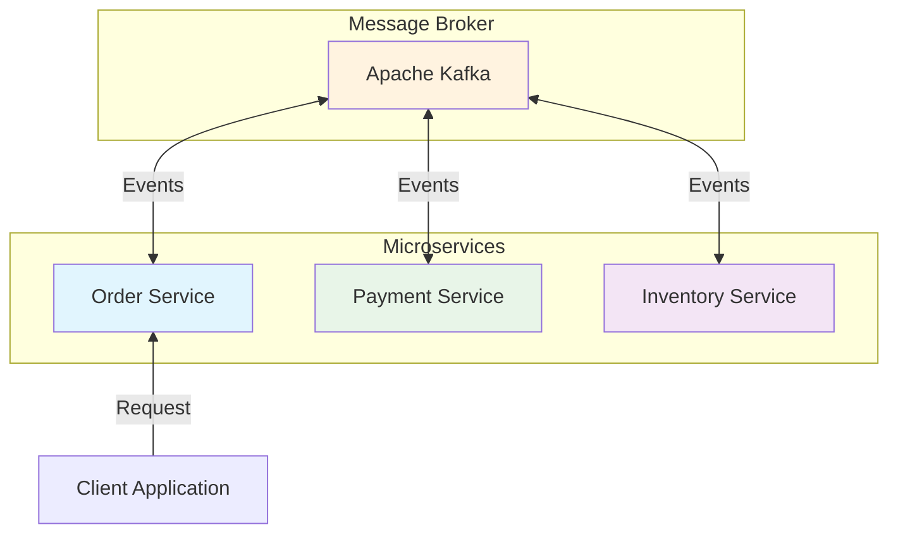

# Choreography Saga Pattern

이 프로젝트는 Choreography 방식의 Saga Pattern 구현 예제 입니다.

## 흐름도


- 각 서비스는 이벤트를 발행 및 구독하며 처리합니다.

## 구성 요소

- **Order Service** (Port 8081): 주문 생성 및 관리
- **Inventory Service** (Port 8082): 재고 관리
- **Payment Service** (Port 8083): 결제 처리
- **Kafka (KRaft)**: 서비스 간 이벤트 메시징

## 실행 방법

### Docker Compose로 실행

```bash
# 모든 서비스 시작
docker-compose up -d

# 로그 확인
docker-compose logs -f

# 서비스 중지
docker-compose down
```

**참고**: 개별 실행 시 Kafka가 로컬에서 실행 중이어야 합니다.

## 포트 구성

- Order Service: 8081
- Inventory Service: 8082
- Payment Service: 8083
- Kafka (Broker): 9092
- Kafka (Controller): 9093

## Saga 흐름

1. **주문 생성**: Order Service가 주문 생성 이벤트 발행
2. **재고 확인**: Inventory Service가 이벤트를 구독하고 재고 차감
3. **결제 처리**: Payment Service가 이벤트를 구독하고 결제 진행
4. **보상 트랜잭션**: 실패 시 각 서비스가 보상 이벤트 발행/처리

## 이벤트 토픽

- `order-created`: 주문 생성 이벤트
- `inventory-reserved`: 재고 예약 완료 이벤트
- `inventory-failed`: 재고 예약 실패 이벤트
- `payment-completed`: 결제 완료 이벤트
- `payment-failed`: 결제 실패 이벤트
- `order-completed`: 주문 완료 이벤트
- `order-cancelled`: 주문 취소 이벤트

## 기술 스택

- Java 17
- Spring Boot 3.2.0
- Kafka (Confluent Platform 7.5.0)
- Gradle
- Docker & Docker Compose
