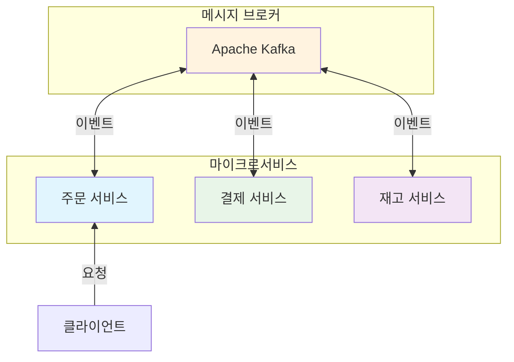
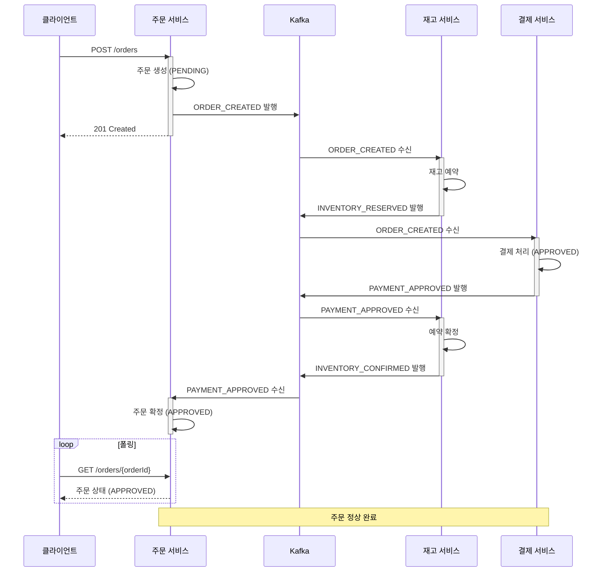
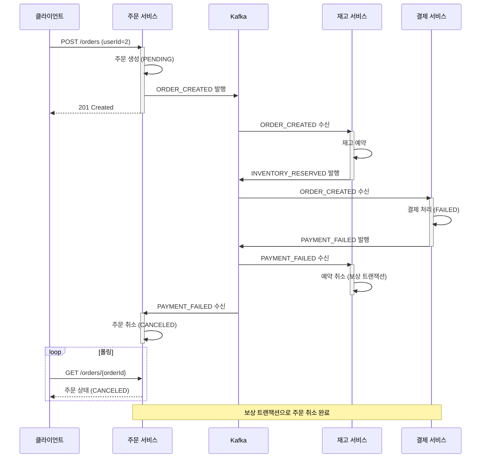
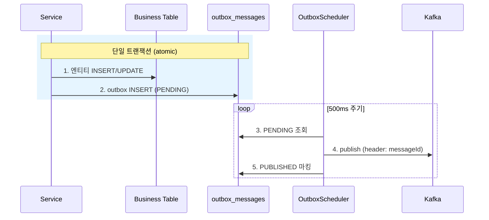
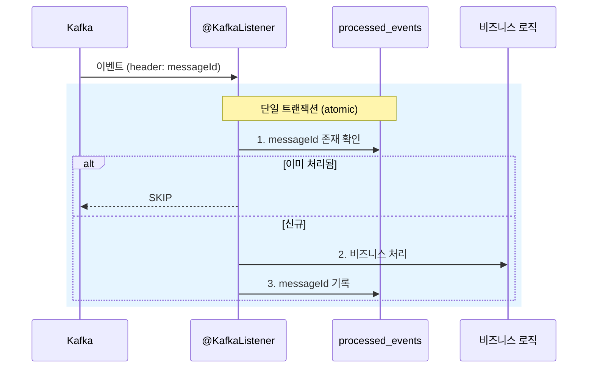

# Choreography Saga Pattern

이 프로젝트는 **Choreography** 방식의 **Saga Pattern**을 구현한 예제입니다.

## Choreography 란?

Choreography 방식은 중앙 조정자 없이 각 서비스가 이벤트를 발행하고 구독하여 분산 트랜잭션을 관리합니다. Orchestration과 달리, 각 서비스는 독립적으로 이벤트에 반응하며 자율적으로 동작합니다.

### 주요 특징

- **분산 제어**: 중앙 조정자 없이 각 서비스가 독립적으로 동작
- **이벤트 기반**: 서비스 간 느슨한 결합으로 확장성 향상
- **자율성**: 각 서비스가 자신의 로직을 독립적으로 관리
- **복잡도 분산**: 비즈니스 로직이 여러 서비스에 분산
- **보상 트랜잭션**: 실패 시 이벤트 기반 자동 롤백

## 아키텍처


```mermaid
flowchart BT
    subgraph subGraph0["메시지 브로커"]
        Kafka["Apache Kafka"]
    end
    subgraph Microservices["마이크로서비스"]
        OS["주문 서비스"]
        PS["결제 서비스"]
        IS["재고 서비스"]
    end
    Client["클라이언트"] -- 요청 --> OS
    OS <-- 이벤트 --> Kafka
    PS <-- 이벤트 --> Kafka
    IS <-- 이벤트 --> Kafka

    style Kafka fill:#fff3e0
    style OS fill:#e1f5fe
    style PS fill:#e8f5e8
    style IS fill:#f3e5f5
```
- 각 서비스는 이벤트를 발행 및 구독하며 처리합니다.

## 구성 요소

- **Order Service** (Port 8081): 주문 생성 및 관리
- **Inventory Service** (Port 8082): 재고 관리
- **Payment Service** (Port 8083): 결제 처리
- **Kafka (KRaft)**: 서비스 간 이벤트 메시징


## 이벤트 흐름

### 성공 시나리오


```mermaid
sequenceDiagram
    participant Client as 클라이언트
    participant OS as 주문 서비스
    participant Kafka
    participant IS as 재고 서비스
    participant PS as 결제 서비스

    Client->>OS: POST /orders
    activate OS
    OS->>OS: 주문 생성 (PENDING)
    OS->>Kafka: ORDER_CREATED 발행
    OS-->>Client: 201 Created
    deactivate OS

    Kafka->>IS: ORDER_CREATED 수신
    activate IS
    IS->>IS: 재고 예약
    IS->>Kafka: INVENTORY_RESERVED 발행
    deactivate IS

    Kafka->>PS: ORDER_CREATED 수신
    activate PS
    PS->>PS: 결제 처리 (APPROVED)
    PS->>Kafka: PAYMENT_APPROVED 발행
    deactivate PS

    Kafka->>IS: PAYMENT_APPROVED 수신
    activate IS
    IS->>IS: 예약 확정
    IS->>Kafka: INVENTORY_CONFIRMED 발행
    deactivate IS

    Kafka->>OS: PAYMENT_APPROVED 수신
    activate OS
    OS->>OS: 주문 확정 (APPROVED)
    deactivate OS

    loop 폴링
        Client->>OS: GET /orders/{orderId}
        OS-->>Client: 주문 상태 (APPROVED)
    end

    Note over OS,PS: 주문 정상 완료
```

### 실패 시나리오


```mermaid
sequenceDiagram
    participant Client as 클라이언트
    participant OS as 주문 서비스
    participant Kafka
    participant IS as 재고 서비스
    participant PS as 결제 서비스

    Client->>OS: POST /orders (userId=2)
    activate OS
    OS->>OS: 주문 생성 (PENDING)
    OS->>Kafka: ORDER_CREATED 발행
    OS-->>Client: 201 Created
    deactivate OS

    Kafka->>IS: ORDER_CREATED 수신
    activate IS
    IS->>IS: 재고 예약
    IS->>Kafka: INVENTORY_RESERVED 발행
    deactivate IS

    Kafka->>PS: ORDER_CREATED 수신
    activate PS
    PS->>PS: 결제 처리 (FAILED)
    PS->>Kafka: PAYMENT_FAILED 발행
    deactivate PS

    Kafka->>IS: PAYMENT_FAILED 수신
    activate IS
    IS->>IS: 예약 취소 (보상 트랜잭션)
    deactivate IS

    Kafka->>OS: PAYMENT_FAILED 수신
    activate OS
    OS->>OS: 주문 취소 (CANCELED)
    deactivate OS

    loop 폴링
        Client->>OS: GET /orders/{orderId}
        OS-->>Client: 주문 상태 (CANCELED)
    end

    Note over OS,PS: 보상 트랜잭션으로 주문 취소 완료
```

### 이벤트 타입

| 서비스 | 발행 이벤트 | 구독 이벤트 |
|--------|-----------|-----------|
| **주문 서비스** | `ORDER_CREATED` | `PAYMENT_APPROVED`, `PAYMENT_FAILED`, `INVENTORY_FAILED` |
| **재고 서비스** | `INVENTORY_RESERVED`, `INVENTORY_CONFIRMED`, `INVENTORY_FAILED` | `ORDER_CREATED`, `PAYMENT_APPROVED`, `PAYMENT_FAILED` |
| **결제 서비스** | `PAYMENT_APPROVED`, `PAYMENT_FAILED` | `ORDER_CREATED` |

## Outbox 패턴

### 문제: 비즈니스 상태와 이벤트 발행이 어긋날 수 있다

`@Transactional`은 DB 안에서만 원자성을 보장합니다. Kafka 메시지 발행은 외부 시스템이라 다음과 같은 문제가 발생할 수 있습니다.

| 시나리오 | 어떻게 발생하나 | 결과 |
|---------|---------------|------|
| **유령 이벤트** | 발행 성공 후 트랜잭션 rollback | DB는 사라졌는데 Kafka 메시지 잔존 |
| **이벤트 유실** | 트랜잭션 commit 후 발행 실패 | DB는 commit됐는데 메시지 발행 안 됨 |
| **요청 가용성 저하** | Kafka 다운 시 send() timeout → 트랜잭션 rollback | Kafka 장애가 사용자 요청 실패로 직결 |

### 해결: Transactional Outbox Pattern 도입

서비스는 Kafka에 직접 발행하지 않고 **DB의 `outbox_messages` 테이블에 이벤트를 INSERT**합니다. 비즈니스 엔티티 변경과 outbox INSERT가 같은 DB 트랜잭션 안에 있으니 원자적으로 commit됩니다. 실제 Kafka 발행은 별도 스케줄러가 PENDING 행을 폴링해서 처리합니다.


```mermaid
sequenceDiagram
    participant S as Service
    participant DB as Business Table
    participant OB as outbox_messages
    participant Sch as OutboxScheduler
    participant Kafka

    rect rgb(230, 245, 255)
        Note over S,OB: 단일 트랜잭션 (atomic)
        S->>DB: 1. 엔티티 INSERT/UPDATE
        S->>OB: 2. outbox INSERT (PENDING)
    end

    loop 500ms 주기
        Sch->>OB: 3. PENDING 조회
        Sch->>Kafka: 4. publish (header: messageId)
        Sch->>OB: 5. PUBLISHED 마킹
    end
```

**위 세 시나리오가 어떻게 해결되는가?**
- **시나리오 A 해결**: 트랜잭션이 rollback되면 outbox 행도 함께 사라져 유령 이벤트 발생 안 함
- **시나리오 B 해결**: 발행 실패 시 PENDING 상태로 남아 다음 폴링에서 자동 재시도 → 메시지 유실 없음
- **시나리오 C 해결**: 사용자 요청 처리는 DB에만 의존 — Kafka 다운 중에도 주문 받기 정상 동작 (outbox에 누적 후 복구 시 발행)

## 컨슈머 멱등성

### 문제: 메시지가 중복 처리될 수 있다

at-least-once 발행을 보장하기 위해 도입한 Outbox 패턴은 그 대가로 **메시지가 중복 발행될 수 있습니다** (예: 발행 ack 직전에 스케줄러가 죽으면 다음 사이클에 같은 행을 재발행). 메시지를 정확히 한 번만 처리하려면 컨슈머 측에서 멱등성을 보장해야 합니다.

### 해결: ProcessedEvent 기반 멱등성

각 컨슈머는 `processed_events` 테이블에 처리한 `messageId`를 기록합니다. 메시지 처리와 messageId 기록이 같은 트랜잭션이라, 중복 수신 시 같은 작업을 두 번 수행하지 않습니다.


```mermaid
sequenceDiagram
    participant Kafka
    participant L as @KafkaListener
    participant PE as processed_events
    participant Biz as 비즈니스 로직

    Kafka->>L: 이벤트 (header: messageId)
    rect rgb(230, 245, 255)
        Note over L,PE: 단일 트랜잭션 (atomic)
        L->>PE: 1. messageId 존재 확인
        alt 이미 처리됨
            L-->>Kafka: SKIP
        else 신규
            L->>Biz: 2. 비즈니스 처리
            L->>PE: 3. messageId 기록
        end
    end
```

## DLQ

이벤트 처리는 두 지점에서 실패할 수 있습니다 (발행 / 소비).

### 메시지 발행 실패
`DLQ` 라우팅 (무한 재시도 방지)

스케줄러는 발행 실패 시 outbox 행에 시도 정보를 누적합니다. 최대 재시도 횟수를 초과하면 해당 메시지는 DLQ라는 토픽으로 발행됩니다.

| 컬럼 | 역할 |
|------|------|
| `retryCount` | 발행 시도 횟수 |
| `lastAttemptAt` | 마지막 시도 시각 |
| `lastError` | 마지막 실패 메시지 (1000자 절단) |

`maxRetryCount` 도달 시 원본 행은 `FAILED`로 격리되고, **DLQ 토픽(`<원본>.DLQ`)으로 보낼 새 메시지를 outbox 에 추가** 합니다.

**핵심 포인트**

- DLQ 발행도 **outbox 메커니즘으로 처리**
- DLQ row 페이로드에 원본 컨텍스트(`originalTopic`, `retryCount`, `lastError`, `failedAt` 등)를 JSON 래퍼로 포함 → DLQ 메시지 하나만 봐도 트러블슈팅 가능
- 무한 루프 가드: `topic.endsWith(".DLQ")` 체크로 DLQ row 자체가 또 실패해도 새 DLQ 안 만듦
- 최후 안전망: DLQ 발행마저 5회 실패 → DB의 `FAILED` 상태로 영구 보관 → 운영자 수동 처리 (`SELECT * FROM outbox_messages WHERE status = 'FAILED'`)

### 메시지 소비 실패 — DLT (Dead Letter Topic)

컨슈머 트랜잭션이 실패하면 Kafka가 재전달합니다. Spring Kafka의 `DefaultErrorHandler`로 정책을 지정합니다. 1초 간격으로 3회 재시도 후에도 실패하면 `<원본>.DLT` 토픽으로 발행하고 offset을 전진시켜 다음 메시지 처리로 넘어갑니다.
컨슈머가 이벤트를 처리 후 commit 만 실패하는 경우에도 중복 재처리는 처리 event 관리 테이블로 방어됩니다.

- 기본값: `consumer.retry.interval-ms=1000`, `consumer.retry.max-attempts=3`
- DLT 토픽: 원본 토픽명 + `.DLT` 접미사 (예: `order-events.DLT`)
- DLT는 별도 컨슈머가 없는 격리 영역 — 운영자가 분석 후 수동 재처리

### 두 메커니즘이 함께 풀어주는 시나리오

| 장애 상황 | 발행 측 (`.DLQ`) | 소비 측 (`.DLT`) |
|----------|-----------------|-----------------|
| Kafka 일시 장애 | PENDING 유지 후 자동 재시도 | (해당 없음) |
| Kafka 영구 불가 | 5회 후 DLQ 라우팅 → DLQ 발행도 5회 실패 시 DB FAILED | (해당 없음) |
| 컨슈머 비즈니스 로직 일시 오류 | (해당 없음) | 1초 간격 3회 재시도 후 통과 또는 DLT |
| 컨슈머 처리 불가능한 메시지 (poison pill) | (해당 없음) | 3회 후 DLT로 격리 → 다음 메시지 처리 진행 |

### 알려진 한계 (개선 여지)

- **폴링 지연**: 기본 500ms. 실시간성이 더 필요하면 CDC로 대체 가능
- **단일 인스턴스 가정**: 다중 인스턴스 스케쥴러는 락 필요
- **고정 backoff**: 현재 컨슈머는 `FixedBackOff`. 운영에선 `ExponentialBackOff` + jitter 권장
- **PUBLISHED 누적**: 오래된 published 행은 별도 정리 작업 필요

## 실행 방법

Kafka, MySQL, 3개 서비스 모두 docker-compose로 한 번에 띄웁니다.

### 1. JAR 빌드

```bash
cd choreography
./gradlew bootJar
```

### 2. docker-compose로 전체 실행

```bash
docker-compose up -d
```

이 명령으로 다음이 한 번에 뜹니다:

| 컨테이너 | 포트 |
|---------|------|
| `kafka` (KRaft 모드) | 9092 |
| `mysql` (3개 DB 자동 생성: orderdb, inventorydb, paymentdb) | 3306 |
| `order-service` | 8081 |
| `inventory-service` | 8082 |
| `payment-service` | 8083 |

서비스들은 `kafka` 헬스체크 통과 후 자동으로 기동되고, MySQL도 마찬가지입니다.

### 3. 종료

```bash
docker-compose down       # 컨테이너만 정리
docker-compose down -v    # 컨테이너 + 볼륨 함께 정리 (DB 초기화)
```

### 4. Saga 테스트

**Success Case:**
```bash
curl -X POST http://localhost:8081/orders \
  -H "Content-Type: application/json" \
  -d '{
    "userId": 1,
    "productId": 1,
    "quantity": 2,
    "price": 10000
  }'
```

응답:
```json
{
  "orderId": 1,
  "userId": 1,
  "productId": 1,
  "quantity": 2,
  "price": 10000,
  "status": "PENDING"
}
```

주문 상태 확인 (폴링):
```bash
curl http://localhost:8081/orders/1
```

최종 상태: `APPROVED`

**Payment Failure Case:**
2번 사용자는 결제 실패하도록 구현되어 있습니다.
```bash
curl -X POST http://localhost:8081/orders \
  -H "Content-Type: application/json" \
  -d '{
    "userId": 2,
    "productId": 1,
    "quantity": 2,
    "price": 10000
  }'
```

최종 상태: `CANCELED` (보상 트랜잭션 실행됨)

## 참고 자료

- [Microservices Patterns: Saga Pattern](https://microservices.io/patterns/data/saga.html)
- [Event-Driven Architecture](https://martinfowler.com/articles/201701-event-driven.html)
- [Choreography vs Orchestration](https://temporal.io/blog/to-choreograph-or-orchestrate-your-saga-that-is-the-question)

