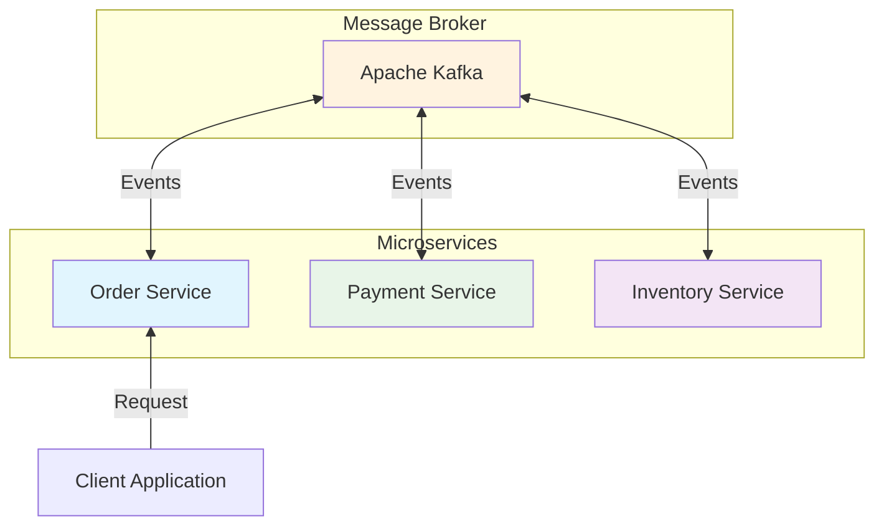
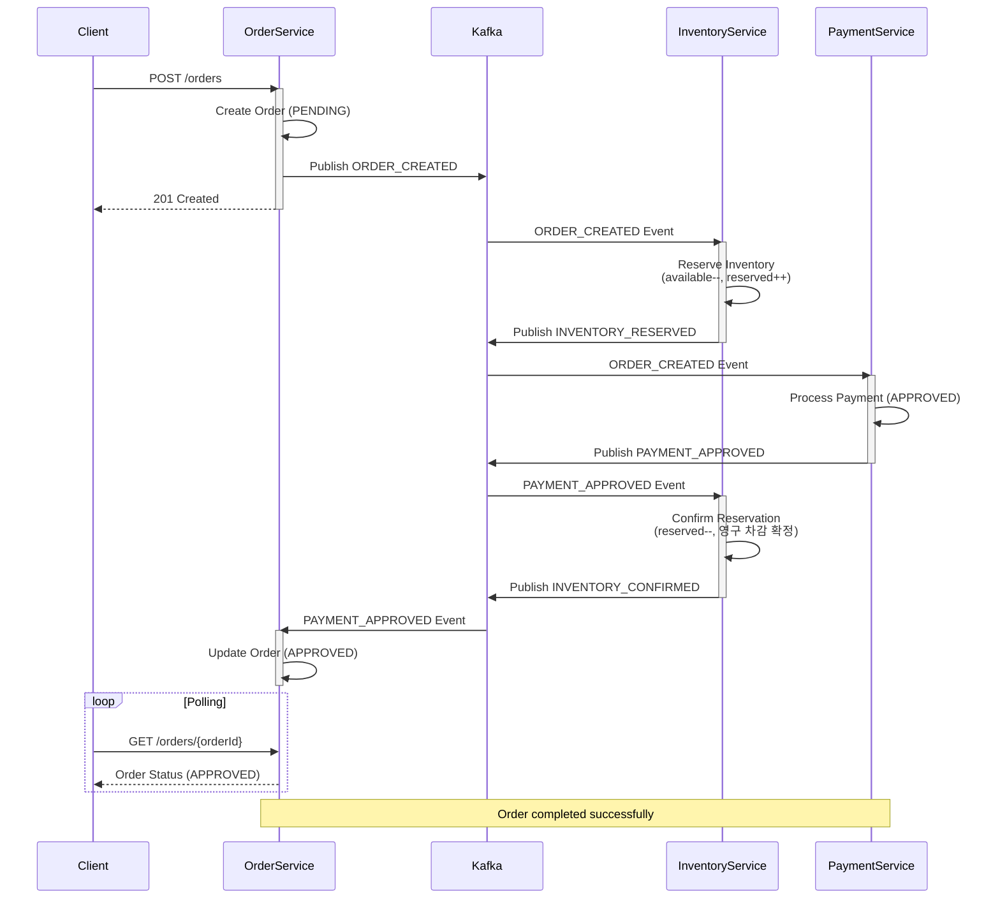
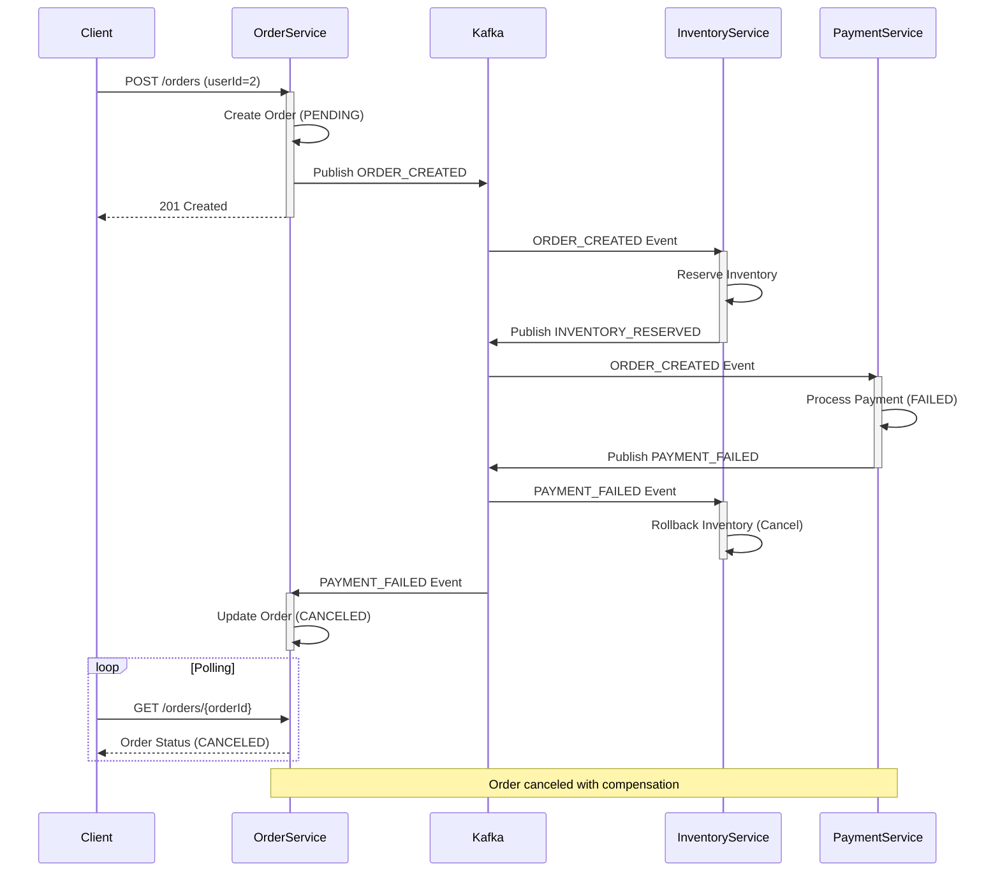
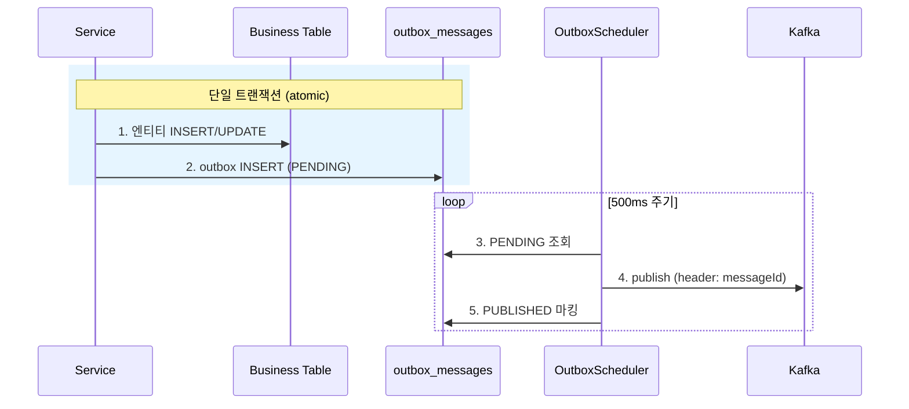
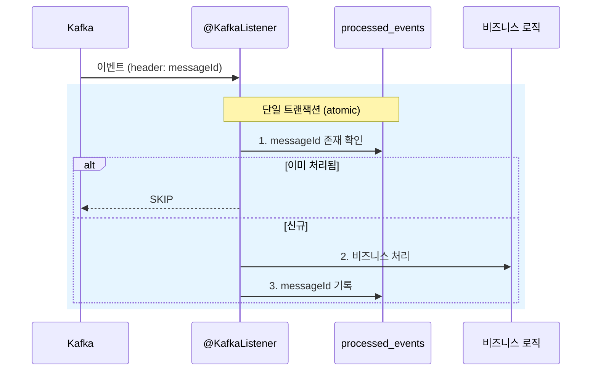

# Choreography Saga Pattern

이 프로젝트는 **Choreography** 방식의 **Saga Pattern**을 구현한 예제입니다.

## Choreography 란?

Choreography 방식은 중앙 조정자 없이 각 서비스가 이벤트를 발행하고 구독하여 분산 트랜잭션을 관리합니다. Orchestration과 달리, 각 서비스는 독립적으로 이벤트에 반응하며 자율적으로 동작합니다.

### 주요 특징

- **분산 제어**: 중앙 조정자 없이 각 서비스가 독립적으로 동작
- **이벤트 기반**: 서비스 간 느슨한 결합으로 확장성 향상
- **자율성**: 각 서비스가 자신의 로직을 독립적으로 관리
- **복잡도 분산**: 비즈니스 로직이 여러 서비스에 분산
- **보상 트랜잭션**: 실패 시 이벤트 기반 자동 롤백

## 아키텍처


```mermaid
flowchart BT
    subgraph subGraph0["Message Broker"]
        Kafka["Apache Kafka"]
    end
    subgraph Microservices["Microservices"]
        OS["Order Service"]
        PS["Payment Service"]
        IS["Inventory Service"]
    end
    Client["Client Application"] -- Request --> OS
    OS <-- Events --> Kafka
    PS <-- Events --> Kafka
    IS <-- Events --> Kafka

    style Kafka fill:#fff3e0
    style OS fill:#e1f5fe
    style PS fill:#e8f5e8
    style IS fill:#f3e5f5
```
- 각 서비스는 이벤트를 발행 및 구독하며 처리합니다.

## 구성 요소

- **Order Service** (Port 8081): 주문 생성 및 관리
- **Inventory Service** (Port 8082): 재고 관리
- **Payment Service** (Port 8083): 결제 처리
- **Kafka (KRaft)**: 서비스 간 이벤트 메시징


## 이벤트 흐름

### Success Flow (성공 시나리오)


```mermaid
sequenceDiagram
    participant Client
    participant OrderService
    participant Kafka
    participant InventoryService
    participant PaymentService

    Client->>OrderService: POST /orders
    activate OrderService
    OrderService->>OrderService: Create Order (PENDING)
    OrderService->>Kafka: Publish ORDER_CREATED
    OrderService-->>Client: 201 Created
    deactivate OrderService

    Kafka->>InventoryService: ORDER_CREATED Event
    activate InventoryService
    InventoryService->>InventoryService: Reserve Inventory<br/>(available--, reserved++)
    InventoryService->>Kafka: Publish INVENTORY_RESERVED
    deactivate InventoryService

    Kafka->>PaymentService: ORDER_CREATED Event
    activate PaymentService
    PaymentService->>PaymentService: Process Payment (APPROVED)
    PaymentService->>Kafka: Publish PAYMENT_APPROVED
    deactivate PaymentService

    Kafka->>InventoryService: PAYMENT_APPROVED Event
    activate InventoryService
    InventoryService->>InventoryService: Confirm Reservation<br/>(reserved--, 영구 차감 확정)
    InventoryService->>Kafka: Publish INVENTORY_CONFIRMED
    deactivate InventoryService

    Kafka->>OrderService: PAYMENT_APPROVED Event
    activate OrderService
    OrderService->>OrderService: Update Order (APPROVED)
    deactivate OrderService

    loop Polling
        Client->>OrderService: GET /orders/{orderId}
        OrderService-->>Client: Order Status (APPROVED)
    end

    Note over OrderService,PaymentService: Order completed successfully
```

### Failure Flow (실패 시나리오)


```mermaid
sequenceDiagram
    participant Client
    participant OrderService
    participant Kafka
    participant InventoryService
    participant PaymentService

    Client->>OrderService: POST /orders (userId=2)
    activate OrderService
    OrderService->>OrderService: Create Order (PENDING)
    OrderService->>Kafka: Publish ORDER_CREATED
    OrderService-->>Client: 201 Created
    deactivate OrderService

    Kafka->>InventoryService: ORDER_CREATED Event
    activate InventoryService
    InventoryService->>InventoryService: Reserve Inventory
    InventoryService->>Kafka: Publish INVENTORY_RESERVED
    deactivate InventoryService

    Kafka->>PaymentService: ORDER_CREATED Event
    activate PaymentService
    PaymentService->>PaymentService: Process Payment (FAILED)
    PaymentService->>Kafka: Publish PAYMENT_FAILED
    deactivate PaymentService

    Kafka->>InventoryService: PAYMENT_FAILED Event
    activate InventoryService
    InventoryService->>InventoryService: Rollback Inventory (Cancel)
    deactivate InventoryService

    Kafka->>OrderService: PAYMENT_FAILED Event
    activate OrderService
    OrderService->>OrderService: Update Order (CANCELED)
    deactivate OrderService

    loop Polling
        Client->>OrderService: GET /orders/{orderId}
        OrderService-->>Client: Order Status (CANCELED)
    end

    Note over OrderService,PaymentService: Order canceled with compensation
```

### Event Types

| Service | Published Events | Subscribed Events |
|---------|-----------------|-------------------|
| **Order Service** | `ORDER_CREATED` | `PAYMENT_APPROVED`, `PAYMENT_FAILED`, `INVENTORY_FAILED` |
| **Inventory Service** | `INVENTORY_RESERVED`, `INVENTORY_CONFIRMED`, `INVENTORY_FAILED` | `ORDER_CREATED`, `PAYMENT_APPROVED`, `PAYMENT_FAILED` |
| **Payment Service** | `PAYMENT_APPROVED`, `PAYMENT_FAILED` | `ORDER_CREATED` |

## 재고 도메인 모델 — 두 단계 예약

재고는 **예약(reserve) → 확정(confirm) / 취소(cancel)** 의 두 단계로 관리됩니다. e-commerce 도메인의 표준 패턴입니다.

### Inventory 엔티티

```java
class Inventory {
    int availableQuantity;   // 예약 가능한 잔여 수량
    int reservedQuantity;    // 예약됐지만 확정 전 수량
}
```

`availableQuantity`는 저장(denormalized) 방식 — 매번 `SUM(reservations)` 집계 안 하고 reserve/confirm/cancel 시점에 트랜잭션으로 같이 갱신해 성능과 정합성 균형.

### InventoryReservation 엔티티

각 예약을 **별도 행으로 추적**해서 누가(orderId) 무엇을(productId) 얼마나(quantity) 예약했는지 명시적으로 보관:

```java
class InventoryReservation {
    Long orderId;          // unique 제약
    Long productId;
    int quantity;
    ReservationStatus status;  // RESERVED / CONFIRMED / CANCELED
    LocalDateTime createdAt;
    LocalDateTime confirmedAt;
    LocalDateTime canceledAt;
}
```

이 구조의 가치:
- **부분 취소 가능**: 한 주문의 특정 reservation만 취소
- **중복 cancel 방어**: status 체크로 멱등 처리 (이미 CONFIRMED/CANCELED면 skip)
- **만료 처리 가능**: createdAt 기반 timeout 도입 가능
- **감사/추적**: 모든 예약 이력 보존
- **정확한 cancel**: orderId로 정확히 매칭 (productId+quantity 추정 X)

### 상태 전이

```
ORDER_CREATED 수신
  └─ availableQuantity 충분 → reserve()
        └─ Inventory: available--, reserved++
        └─ Reservation 생성 (status=RESERVED)
        └─ INVENTORY_RESERVED 발행
  └─ availableQuantity 부족
        └─ INVENTORY_FAILED 발행 (Reservation 미생성)

PAYMENT_APPROVED 수신
  └─ Reservation.confirm()
        └─ Inventory: reserved-- (영구 차감, available 변동 없음)
        └─ Reservation: status=CONFIRMED, confirmedAt 기록
        └─ INVENTORY_CONFIRMED 발행

PAYMENT_FAILED 수신
  └─ Reservation.cancel()
        └─ Inventory: reserved--, available++ (복원)
        └─ Reservation: status=CANCELED, canceledAt 기록
```

## 신뢰성 보장 — Outbox 패턴과 컨슈머 멱등성

EDA에서 가장 까다로운 두 가지 문제를 풀기 위한 구조입니다.

### 문제 1: Dual Write Problem

`@Transactional` 안에서 DB 작업과 Kafka 발행을 함께 수행하면 두 시스템의 원자성이 보장되지 않습니다.

| 시나리오 | 결과 |
|---------|------|
| 발행 후 트랜잭션 rollback | DB 변경은 사라지지만 Kafka에 **유령 이벤트** 잔존 |
| 트랜잭션 commit 후 발행 실패 | DB는 변경되었지만 Kafka 메시지가 **유실** |

### 해결: Transactional Outbox Pattern

서비스는 Kafka에 직접 발행하지 않고 **자기 DB의 `outbox_messages` 테이블에 이벤트를 INSERT**합니다. 비즈니스 엔티티 변경과 outbox INSERT가 같은 트랜잭션이라 원자적으로 commit 됩니다. 별도 스케줄러가 PENDING 행을 폴링해서 Kafka에 실제 발행하고 PUBLISHED로 마킹합니다.


```mermaid
sequenceDiagram
    participant S as Service
    participant DB as Business Table
    participant OB as outbox_messages
    participant Sch as OutboxScheduler
    participant Kafka

    rect rgb(230, 245, 255)
        Note over S,OB: 단일 트랜잭션 (atomic)
        S->>DB: 1. 엔티티 INSERT/UPDATE
        S->>OB: 2. outbox INSERT (PENDING)
    end

    loop 500ms 주기
        Sch->>OB: 3. PENDING 조회
        Sch->>Kafka: 4. publish (header: messageId)
        Sch->>OB: 5. PUBLISHED 마킹
    end
```

- 트랜잭션이 rollback되면 outbox 행도 함께 사라짐 → 유령 이벤트 방지
- 발행 실패 시 PENDING 상태로 남아 다음 폴링에서 자동 재시도 → 메시지 유실 방지

### 문제 2: 컨슈머 중복 처리

Kafka는 at-least-once 전달이 기본이라 같은 이벤트가 두 번 도착할 수 있습니다.

### 해결: ProcessedEvent 기반 멱등성

각 컨슈머는 `processed_events` 테이블에 처리한 `messageId`를 기록합니다. 메시지 처리와 messageId 기록이 같은 트랜잭션이라, 중복 수신 시 같은 작업을 두 번 수행하지 않습니다.


```mermaid
sequenceDiagram
    participant Kafka
    participant L as @KafkaListener
    participant PE as processed_events
    participant Biz as 비즈니스 로직

    Kafka->>L: 이벤트 (header: messageId)
    rect rgb(230, 245, 255)
        Note over L,PE: 단일 트랜잭션 (atomic)
        L->>PE: 1. messageId 존재 확인
        alt 이미 처리됨
            L-->>Kafka: SKIP
        else 신규
            L->>Biz: 2. 비즈니스 처리
            L->>PE: 3. messageId 기록
        end
    end
```

### 핵심 컴포넌트

| 컴포넌트 | 위치 | 역할 |
|---------|------|------|
| `OutboxMessage` | `outbox/` | 발행 대기 이벤트 엔티티 (PENDING / PUBLISHED / FAILED) |
| `OutboxService` | `outbox/` | 비즈니스 트랜잭션 내에서 outbox 행 적재 (`Propagation.MANDATORY`) |
| `OutboxScheduler` | `outbox/` | 500ms 주기 폴링 발행 (`@Scheduled`), 재시도/DLQ 처리 |
| `ProcessedEvent` | `idempotency/` | 처리 완료 messageId 기록 |
| `IdempotencyService` | `idempotency/` | 중복 체크 / 처리 마킹 |
| `KafkaConsumerConfig` | `config/` | 컨슈머 측 재시도 + DLT 발행 핸들러 |

## 실패 처리 — DLQ + 재시도

이벤트 처리는 두 지점에서 실패할 수 있습니다 (발행 / 소비). 각각 다른 메커니즘으로 격리합니다.

### 발행 측 실패 — Outbox FAILED 상태 (DB 기반 DLQ)

스케줄러가 Kafka로 발행하다 실패하면 outbox 행에 실패 정보를 누적합니다.

| 컬럼 | 역할 |
|------|------|
| `retryCount` | 발행 시도 횟수 |
| `lastAttemptAt` | 마지막 시도 시각 |
| `lastError` | 마지막 실패 메시지 (1000자 절단) |

```
[PENDING] → 발행 시도 → 성공 → [PUBLISHED]
                     ↓ 실패
                     → retryCount++
                     ↓ retryCount < max
                     → [PENDING] (다음 폴링에서 재시도)
                     ↓ retryCount >= max
                     → [FAILED] (더 이상 폴링 대상 아님)
```

- 기본값 `outbox.max-retry-count=5` (application.yml로 오버라이드 가능)
- `FAILED` 행은 폴러 쿼리에서 제외돼 무한 루프 방지
- 운영 단계에서 `SELECT * FROM outbox_messages WHERE status = 'FAILED'`로 수동 분석/복구

### 소비 측 실패 — DLT (Dead Letter Topic)

컨슈머 트랜잭션이 실패하면 Kafka가 재전달합니다. Spring Kafka의 `DefaultErrorHandler`로 정책을 지정합니다.

```
event 도착 → @KafkaListener 처리 → 성공 → offset commit
                                ↓ 실패
                                → 1초 후 재전달 (offset 미커밋)
                                ↓ 3회 모두 실패
                                → DLT 토픽으로 발행 (`<topic>.DLT`)
                                → offset 전진
```

- 기본값: `consumer.retry.interval-ms=1000`, `consumer.retry.max-attempts=3`
- DLT 토픽: 원본 토픽명 + `.DLT` 접미사 (예: `order-events.DLT`)
- DLT는 별도 컨슈머가 없는 격리 영역 — 운영자가 분석 후 수동 재처리

### 두 메커니즘이 함께 풀어주는 시나리오

| 장애 상황 | Outbox 측 | DLT 측 |
|----------|----------|--------|
| Kafka 일시 장애 | PENDING 유지 후 자동 재시도 | (해당 없음) |
| Kafka 영구 불가 | FAILED 마킹 (5회 후) | (해당 없음) |
| 컨슈머 비즈니스 로직 일시 오류 | (해당 없음) | 1초 간격 3회 재시도 후 통과 또는 DLT |
| 컨슈머 처리 불가능한 메시지 (poison pill) | (해당 없음) | 3회 후 DLT로 격리 → 다음 메시지 처리 진행 |

### 알려진 한계 (개선 여지)

- **폴링 지연**: 기본 500ms. 실시간성이 더 필요하면 Debezium CDC로 대체 가능
- **단일 인스턴스 가정**: 다중 인스턴스 폴러는 `SELECT ... FOR UPDATE SKIP LOCKED` 등 락 필요
- **고정 backoff**: 현재 컨슈머는 `FixedBackOff`. 운영에선 `ExponentialBackOff` + jitter 권장
- **PUBLISHED 누적**: 오래된 published 행은 별도 정리 작업 필요
- **DLT 모니터링 부재**: 격리된 메시지의 알림/대시보드는 미구현

## 실행 방법

### 1. Kafka 실행
```bash
cd choreography
docker-compose up -d
```

### 2. 각 서비스 실행

**Order Service (Port 8081):**
```bash
cd order
./gradlew bootRun
```

**Inventory Service (Port 8082):**
```bash
cd inventory
./gradlew bootRun
```

**Payment Service (Port 8083):**
```bash
cd payment
./gradlew bootRun
```

### 3. Saga 테스트

**Success Case:**
```bash
curl -X POST http://localhost:8081/orders \
  -H "Content-Type: application/json" \
  -d '{
    "userId": 1,
    "productId": 1,
    "quantity": 2,
    "price": 10000
  }'
```

응답:
```json
{
  "orderId": 1,
  "userId": 1,
  "productId": 1,
  "quantity": 2,
  "price": 10000,
  "status": "PENDING"
}
```

주문 상태 확인 (폴링):
```bash
curl http://localhost:8081/orders/1
```

최종 상태: `APPROVED`

**Payment Failure Case:**
2번 사용자는 결제 실패하도록 구현되어 있습니다.
```bash
curl -X POST http://localhost:8081/orders \
  -H "Content-Type: application/json" \
  -d '{
    "userId": 2,
    "productId": 1,
    "quantity": 2,
    "price": 10000
  }'
```

최종 상태: `CANCELED` (보상 트랜잭션 실행됨)

## 참고 자료

- [Microservices Patterns: Saga Pattern](https://microservices.io/patterns/data/saga.html)
- [Event-Driven Architecture](https://martinfowler.com/articles/201701-event-driven.html)
- [Choreography vs Orchestration](https://temporal.io/blog/to-choreograph-or-orchestrate-your-saga-that-is-the-question)

