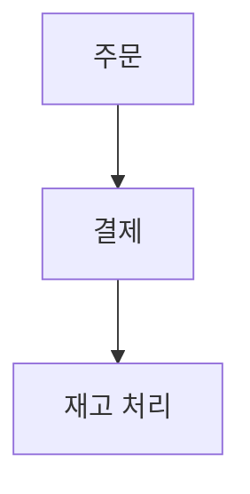
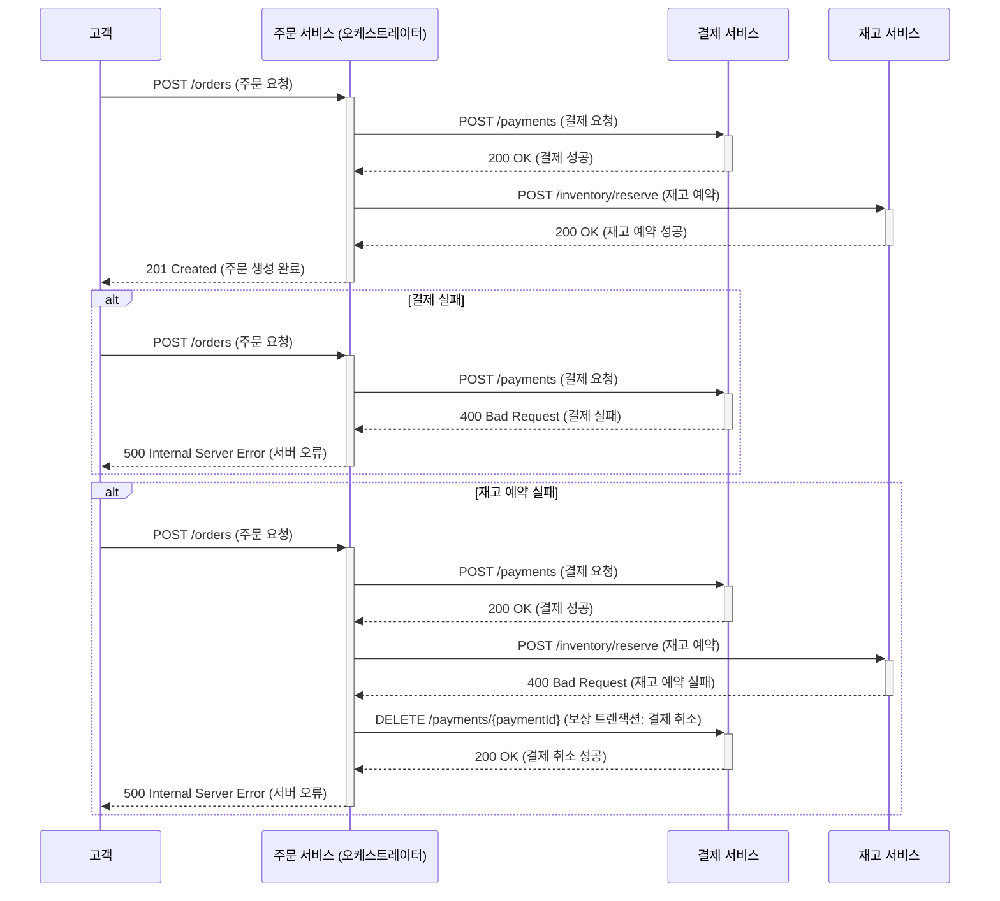
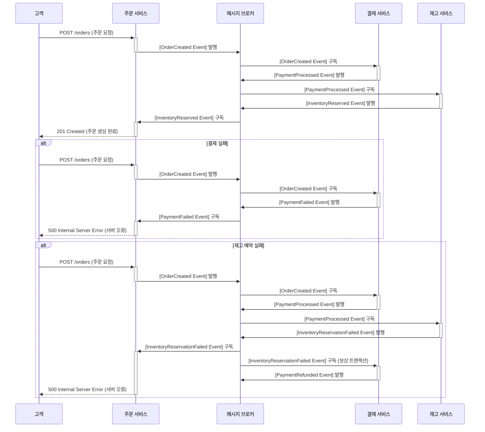

# 분산 트랜잭션 패턴: Orchestration vs. Choreography

이 문서는 마이크로서비스 기반 시스템에서 분산 트랜잭션의 흐름을 설명하고, 두 가지 일반적인 패턴인 Orchestration과 Choreography를 보여줍니다.

## 시나리오: 전자상거래 주문

고객이 주문하는 일반적인 전자상거래 시나리오를 사용합니다. 여기에는 세 가지 서비스가 포함됩니다.
*   **주문 서비스:** 주문을 생성합니다.
*   **결제 서비스:** 결제를 처리합니다.
*   **재고 서비스:** 재고를 예약합니다.

## 일반적인 흐름

## 1. Orchestration (오케스트레이션)

오케스트레이션 패턴에서는 중앙 "오케스트레이터" 서비스(이 경우 **주문 서비스**)가 전체 트랜잭션을 관리하고 각 서비스에 수행할 작업을 지시합니다.

## 2. Choreography (코레오그래피)

코레오그래피 패턴에서 각 서비스는 독립적으로 작동하고 다른 서비스에서 게시한 이벤트에 반응합니다. 중앙 조정자는 없습니다.

