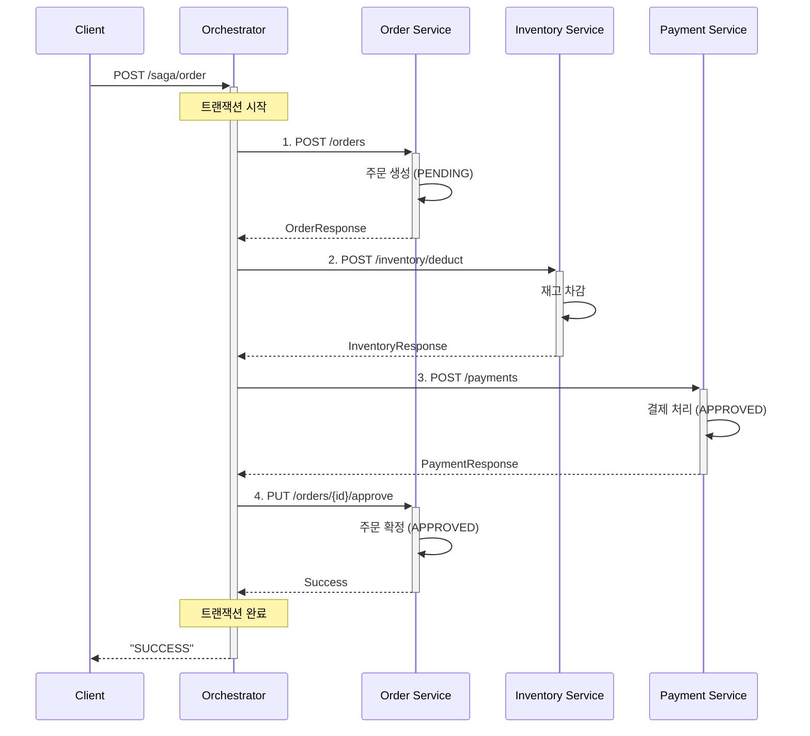
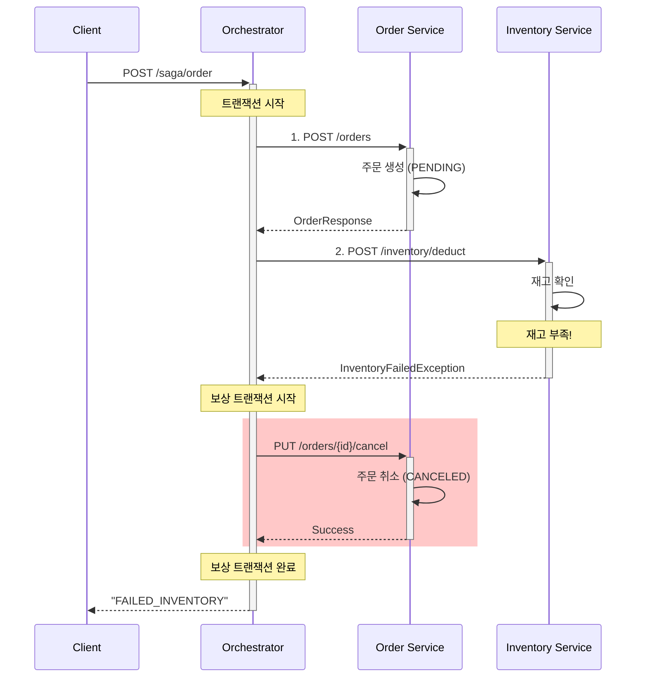
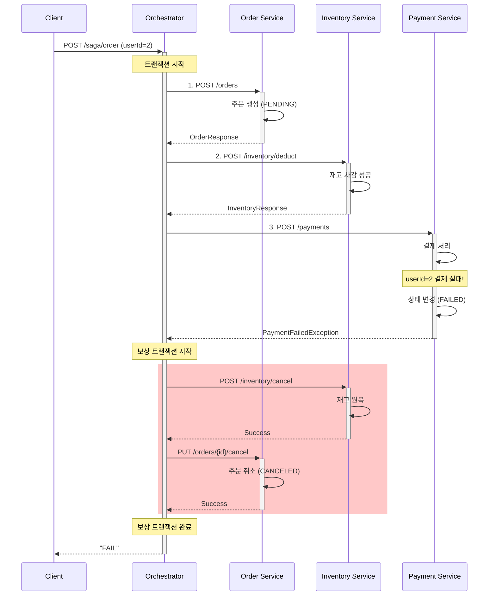
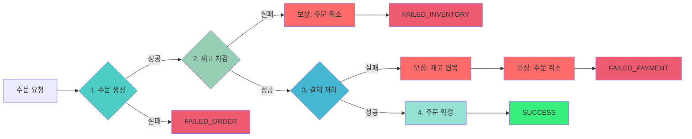

# Orchestration Saga Pattern

이 프로젝트는 **Orchestration**방식의 **Saga Pattern**을 구현한 예제입니다.

## Orchestration 이란?

Orchestration 방식은 중앙 조정자(Orchestrator)를 사용하여 여러 서비스에 걸친 트랜잭션을 관리합니다. 서비스들이 이벤트를 통해 직접 통신하는 Choreography와 달리, Orchestration은 중앙 집중식 제어와 명확한 트랜잭션 흐름 관리를 제공합니다.

### 주요 특징

- **중앙 집중식 제어**: 단일 Orchestrator가 모든 트랜잭션 단계를 조정
- **명시적 흐름**: 한 곳에 정의된 명확하고 순차적인 트랜잭션 단계
- **쉬운 디버깅**: 중앙 집중식 로직으로 문제 해결이 간단함
- **높은 가시성**: 트랜잭션 상태를 모니터링할 수 있는 단일 지점
- **보상 트랜잭션**: 실패 시 자동 롤백

## 핵심 구현

### OrchestrationService

Orchestrator가 모든 트랜잭션을 조정합니다:

```java
public String orderSagaTransaction(OrderRequest request) {
    String transactionId = UUID.randomUUID().toString();
    Long orderId = null;
    Long paymentId = null;

    try {
        // Step 1: Create Order
        OrderResponse orderResponse = orderClient.createOrder(request).block();
        orderId = orderResponse.orderId();

        // Step 2: Process Payment
        PaymentRequest paymentRequest = new PaymentRequest(orderId, userId, totalAmount);
        PaymentResponse paymentResponse = paymentClient.createPayment(paymentRequest).block();
        paymentId = paymentResponse.paymentId();

        // Step 3: Reserve Inventory
        InventoryRequest inventoryRequest = new InventoryRequest(orderId, productId, quantity);
        inventoryClient.reserveInventory(inventoryRequest).block();

        return "SUCCESS";

    } catch (PaymentFailedException e) {
        // Compensate: Cancel Order
        orderClient.cancelOrder(orderId).block();
        return "FAILED_PAYMENT";

    } catch (InventoryFailedException e) {
        // Compensate: Cancel Payment and Order
        paymentClient.cancelPayment(paymentId).block();
        orderClient.cancelOrder(orderId).block();
        return "FAILED_INVENTORY";
    }
}
```

### Saga 테스트

**Success Case:**
```bash
curl -X POST http://localhost:8080/saga/order \
  -H "Content-Type: application/json" \
  -d '{
    "userId": 1,
    "productId": 1,
    "quantity": 2,
    "price": 10000
  }'
```

**Inventory Failure Case:**
```bash
curl -X POST http://localhost:8080/saga/order \
  -H "Content-Type: application/json" \
  -d '{
    "userId": 1,
    "productId": 1,
    "quantity": 999,
    "price": 10000
  }'
```

**Payment Failure Case:**  
2번 사용자 결제 실패
```bash
curl -X POST http://localhost:8080/saga/order \
  -H "Content-Type: application/json" \
  -d '{
    "userId": 2,
    "productId": 1,
    "quantity": 999,
    "price": 10000
  }'
```

### 성공 시나리오



### 재고 부족 실패 시나리오



### 결제 실패 시나리오



### 트랜잭션 흐름 요약




## 참고 자료

- [Microservices Patterns: Saga Pattern](https://microservices.io/patterns/data/saga.html)
- [Compensating Transaction Pattern](https://learn.microsoft.com/en-us/azure/architecture/patterns/compensating-transaction)
