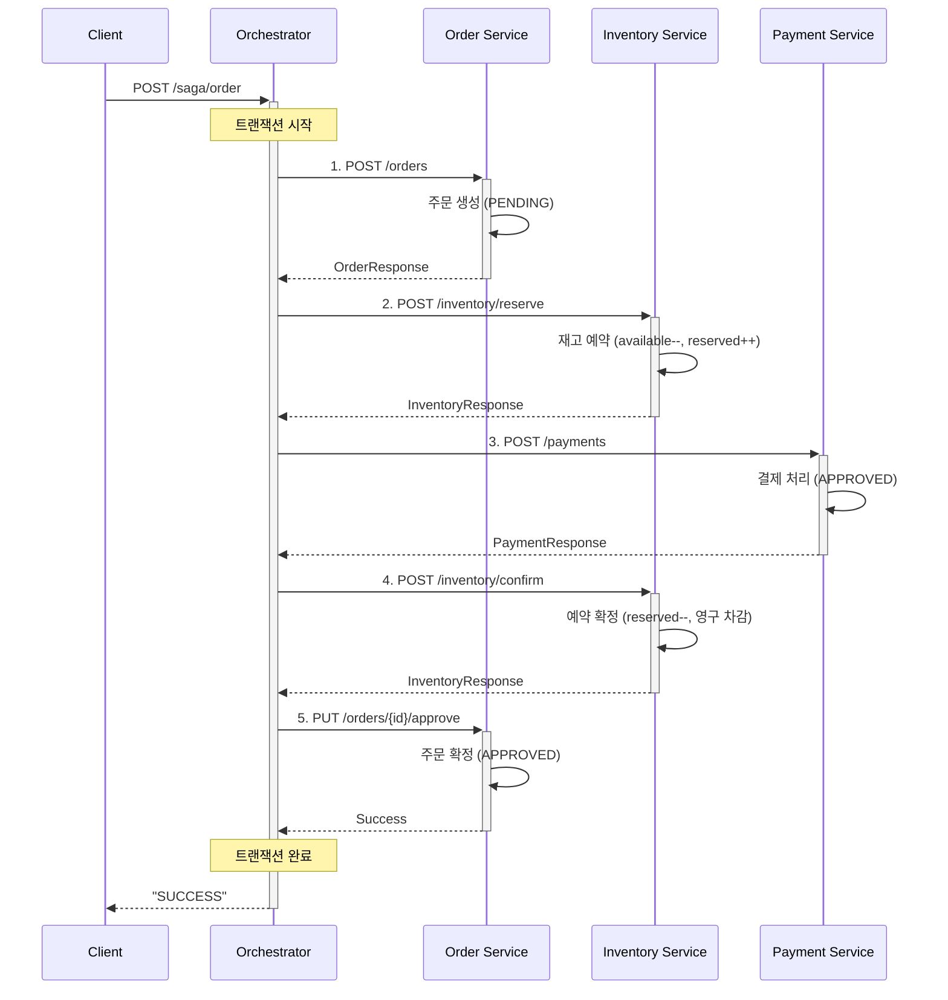
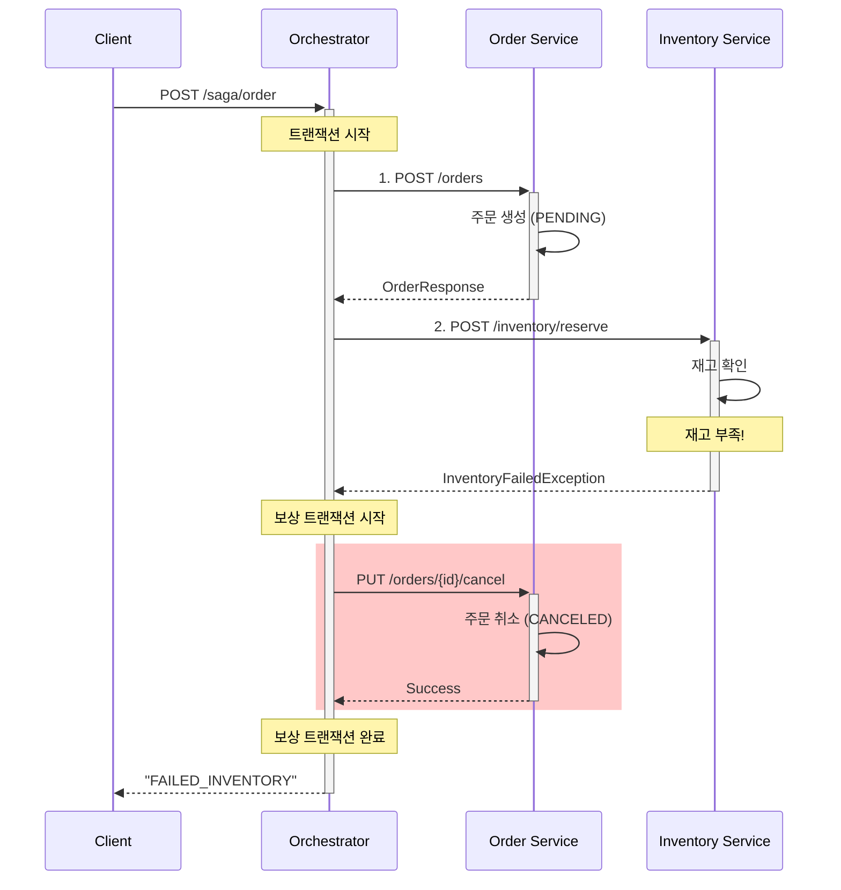
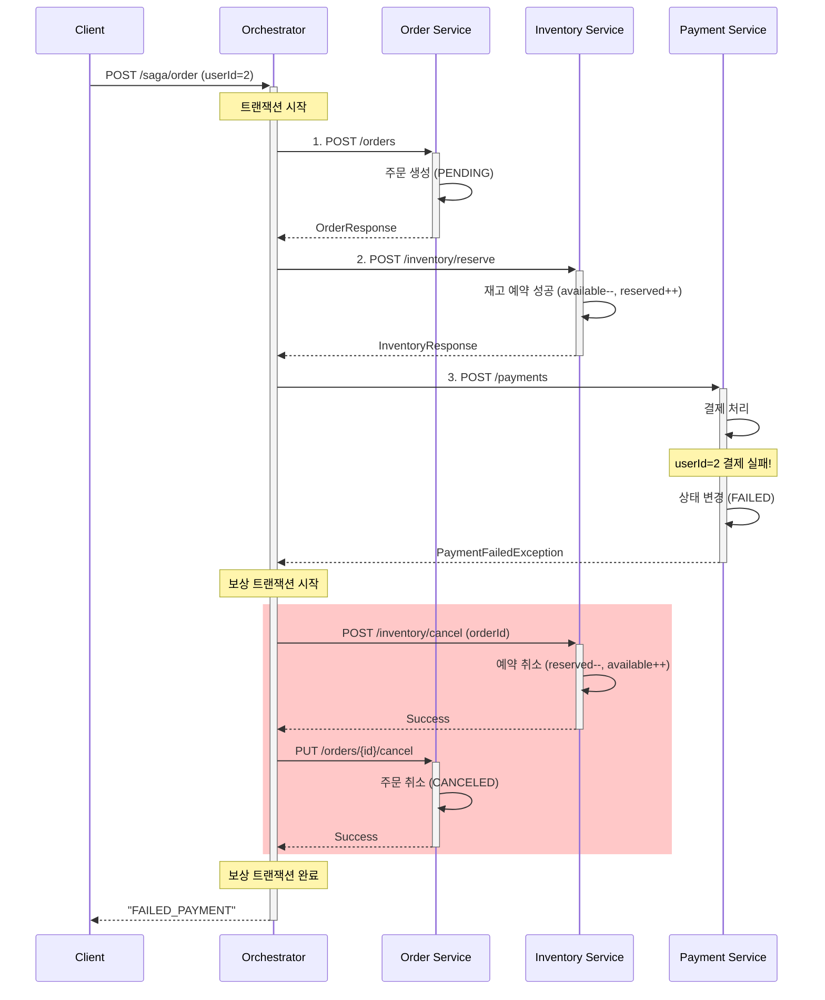
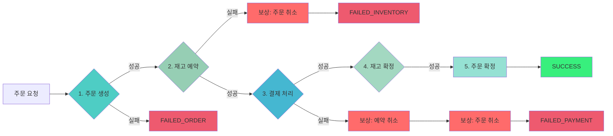

# Orchestration Saga Pattern

이 프로젝트는 **Orchestration**방식의 **Saga Pattern**을 구현한 예제입니다.

## Orchestration 이란?

Orchestration 방식은 중앙 조정자(Orchestrator)를 사용하여 여러 서비스에 걸친 트랜잭션을 관리합니다. 서비스들이 이벤트를 통해 직접 통신하는 Choreography와 달리, Orchestration은 중앙 집중식 제어와 명확한 트랜잭션 흐름 관리를 제공합니다.

### 주요 특징

- **중앙 집중식 제어**: 단일 Orchestrator가 모든 트랜잭션 단계를 조정
- **명시적 흐름**: 한 곳에 정의된 명확하고 순차적인 트랜잭션 단계
- **쉬운 디버깅**: 중앙 집중식 로직으로 문제 해결이 간단함
- **높은 가시성**: 트랜잭션 상태를 모니터링할 수 있는 단일 지점
- **보상 트랜잭션**: 실패 시 자동 롤백

## 핵심 구현

### OrchestrationService

Orchestrator가 모든 트랜잭션을 조정합니다:

```java
public String orderSagaTransaction(OrderRequest request) {
    Long orderId = null;
    try {
        // Step 1: Create Order
        OrderResponse orderResponse = orderClient.createOrder(request).block();
        orderId = orderResponse.orderId();

        // Step 2: Reserve Inventory (available -> reserved)
        InventoryRequest inventoryRequest = new InventoryRequest(orderId, orderResponse.productId(), orderResponse.quantity());
        inventoryClient.reserveInventory(inventoryRequest).block();

        // Step 3: Process Payment
        Long userId = orderResponse.userId();
        BigDecimal totalAmount = new BigDecimal(orderResponse.quantity()).multiply(orderResponse.price());
        PaymentRequest paymentRequest = new PaymentRequest(orderId, userId, totalAmount);
        paymentClient.createPayment(paymentRequest).block();

        // Step 4: Confirm Inventory Reservation (reserved -> permanently deducted)
        inventoryClient.confirmInventory(new InventoryConfirmRequest(orderId)).block();

        // Step 5: Approve Order
        orderClient.approveOrder(orderId).block();

        return "SUCCESS";

    } catch (OrderFailedException e) {
        return "FAILED_ORDER";

    } catch (InventoryFailedException e) {
        // Compensate: Cancel Order
        orderClient.cancelOrder(orderId).block();
        return "FAILED_INVENTORY";

    } catch (PaymentFailedException e) {
        // Compensate: Cancel Reservation (by orderId) + Cancel Order
        inventoryClient.cancelInventory(new InventoryCancelRequest(orderId)).block();
        orderClient.cancelOrder(orderId).block();
        return "FAILED_PAYMENT";
    }
}
```

### Saga 테스트

**Success Case:**
```bash
curl -X POST http://localhost:8080/saga/order \
  -H "Content-Type: application/json" \
  -d '{
    "userId": 1,
    "productId": 1,
    "quantity": 2,
    "price": 10000
  }'
```

**Inventory Failure Case:**
```bash
curl -X POST http://localhost:8080/saga/order \
  -H "Content-Type: application/json" \
  -d '{
    "userId": 1,
    "productId": 1,
    "quantity": 999,
    "price": 10000
  }'
```

**Payment Failure Case:**  
2번 사용자 결제 실패
```bash
curl -X POST http://localhost:8080/saga/order \
  -H "Content-Type: application/json" \
  -d '{
    "userId": 2,
    "productId": 1,
    "quantity": 999,
    "price": 10000
  }'
```

### 성공 시나리오


```mermaid
sequenceDiagram
    participant C as Client
    participant O as Orchestrator
    participant Order as Order Service
    participant Inv as Inventory Service
    participant Pay as Payment Service

    C->>+O: POST /saga/order
    Note over O: 트랜잭션 시작

    O->>+Order: 1. POST /orders
    Order->>Order: 주문 생성 (PENDING)
    Order-->>-O: OrderResponse

    O->>+Inv: 2. POST /inventory/reserve
    Inv->>Inv: 재고 예약 (available--, reserved++)
    Inv-->>-O: InventoryResponse

    O->>+Pay: 3. POST /payments
    Pay->>Pay: 결제 처리 (APPROVED)
    Pay-->>-O: PaymentResponse

    O->>+Inv: 4. POST /inventory/confirm
    Inv->>Inv: 예약 확정 (reserved--, 영구 차감)
    Inv-->>-O: InventoryResponse

    O->>+Order: 5. PUT /orders/{id}/approve
    Order->>Order: 주문 확정 (APPROVED)
    Order-->>-O: Success

    Note over O: 트랜잭션 완료
    O-->>-C: "SUCCESS"
```

### 재고 부족 실패 시나리오


```mermaid
sequenceDiagram
    participant C as Client
    participant O as Orchestrator
    participant Order as Order Service
    participant Inv as Inventory Service

    C->>+O: POST /saga/order
    Note over O: 트랜잭션 시작

    O->>+Order: 1. POST /orders
    Order->>Order: 주문 생성 (PENDING)
    Order-->>-O: OrderResponse

    O->>+Inv: 2. POST /inventory/reserve
    Inv->>Inv: 재고 확인
    Note over Inv: 재고 부족!
    Inv-->>-O: InventoryFailedException

    Note over O: 보상 트랜잭션 시작
    rect rgb(255, 200, 200)
        O->>+Order: PUT /orders/{id}/cancel
        Order->>Order: 주문 취소 (CANCELED)
        Order-->>-O: Success
    end

    Note over O: 보상 트랜잭션 완료
    O-->>-C: "FAILED_INVENTORY"
```

### 결제 실패 시나리오


```mermaid
sequenceDiagram
    participant C as Client
    participant O as Orchestrator
    participant Order as Order Service
    participant Inv as Inventory Service
    participant Pay as Payment Service

    C->>+O: POST /saga/order (userId=2)
    Note over O: 트랜잭션 시작

    O->>+Order: 1. POST /orders
    Order->>Order: 주문 생성 (PENDING)
    Order-->>-O: OrderResponse

    O->>+Inv: 2. POST /inventory/reserve
    Inv->>Inv: 재고 예약 성공 (available--, reserved++)
    Inv-->>-O: InventoryResponse

    O->>+Pay: 3. POST /payments
    Pay->>Pay: 결제 처리
    Note over Pay: userId=2 결제 실패!
    Pay->>Pay: 상태 변경 (FAILED)
    Pay-->>-O: PaymentFailedException

    Note over O: 보상 트랜잭션 시작
    rect rgb(255, 200, 200)
        O->>+Inv: POST /inventory/cancel (orderId)
        Inv->>Inv: 예약 취소 (reserved--, available++)
        Inv-->>-O: Success

        O->>+Order: PUT /orders/{id}/cancel
        Order->>Order: 주문 취소 (CANCELED)
        Order-->>-O: Success
    end

    Note over O: 보상 트랜잭션 완료
    O-->>-C: "FAILED_PAYMENT"
```

### 트랜잭션 흐름 요약


```mermaid
graph LR
    A[주문 요청] --> B{1. 주문 생성}
    B -->|성공| C{2. 재고 예약}
    B -->|실패| Z[FAILED_ORDER]

    C -->|성공| D{3. 결제 처리}
    C -->|실패| E[보상: 주문 취소]
    E --> Y[FAILED_INVENTORY]

    D -->|성공| F2{4. 재고 확정}
    D -->|실패| G[보상: 예약 취소]
    G --> H[보상: 주문 취소]
    H --> X[FAILED_PAYMENT]

    F2 -->|성공| F[5. 주문 확정]
    F --> W[SUCCESS]

    style B fill:#4ecdc4
    style C fill:#96ceb4
    style D fill:#45b7d1
    style F2 fill:#a3d8c1
    style F fill:#95e1d3
    style E fill:#ff6b6b
    style G fill:#ff6b6b
    style H fill:#ff6b6b
    style W fill:#38ef7d
    style X fill:#ee5a6f
    style Y fill:#ee5a6f
    style Z fill:#ee5a6f
```


## 참고 자료

- [Microservices Patterns: Saga Pattern](https://microservices.io/patterns/data/saga.html)
- [Compensating Transaction Pattern](https://learn.microsoft.com/en-us/azure/architecture/patterns/compensating-transaction)
